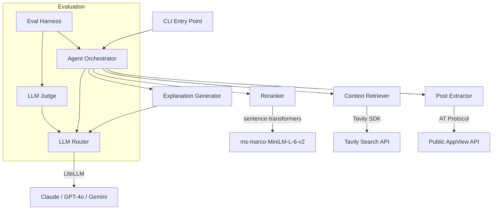

# Contextual Post Explainer

A CLI-first Python agent that explains Bluesky posts by retrieving relevant web context. Given a post URL, the agent fetches the post content via the AT Protocol, searches for related context using Tavily, reranks results with a cross-encoder model, and generates 3–5 explanatory bullets using your choice of LLM provider.

## Architecture



**Pipeline flow:**

```
URL → Post Extractor → Context Retriever → Reranker → Explanation Generator → Bullets
```

## Setup

### Prerequisites

- Python >= 3.11
- API keys for at least one LLM provider (Anthropic, OpenAI, or Google)
- Tavily API key for web search

### Installation

```bash
git clone <repo-url>
cd contextual-post-explainer

python3 -m venv venv
source venv/bin/activate

pip install -e ".[dev]"
```

### Configuration

Copy the environment template and fill in your API keys:

```bash
cp .env.example .env
```

Required keys in `.env`:

| Variable | Purpose |
|----------|---------|
| `TAVILY_API_KEY` | Web search via Tavily (required) |
| `OPENAI_API_KEY` | GPT-4o provider |
| `ANTHROPIC_API_KEY` | Claude provider |
| `GOOGLE_API_KEY` | Gemini provider |

You need at least one LLM provider key configured. The agent will fall back through available providers if the primary one fails.

## Usage

### Basic

```bash
explain https://bsky.app/profile/user.bsky.social/post/abc123
```

### Specify a provider

```bash
explain -p gpt-4o https://bsky.app/profile/user.bsky.social/post/abc123
```

### Verbose mode (show intermediate steps)

```bash
explain -v https://bsky.app/profile/user.bsky.social/post/abc123
```

Verbose mode prints search results, reranking scores, and post metadata before the explanation bullets.

### Example output

```
• The post references the "Ralph Wiggum technique," a method coined by Geoffrey Huntley
  in mid-2025 for running AI coding agents in a bash loop until tests pass [source: huntley.dev]
• The technique is named after the Simpsons character Ralph Wiggum, known for naive
  persistence, mirroring how the loop retries without understanding [source: reddit.com/r/programming]
• Community reception has been mixed — some developers praise the pragmatism while others
  warn about runaway API costs and non-deterministic outputs [source: news.ycombinator.com]
• The method spawned derivatives including a $RALPH memecoin and variations like
  "Ralph Wiggum TDD" that add test-writing to the loop [source: x.com/threadreader]
```

## Design Decisions

### Pipeline Architecture

Each stage of the pipeline (extraction, retrieval, reranking, generation) is a standalone module with well-defined interfaces. This makes components independently testable, swappable, and easy to reason about in isolation.

### Cross-Encoder Reranking

Search results from Tavily are reranked using `cross-encoder/ms-marco-MiniLM-L-6-v2` rather than relying on BM25 or the search engine's native scoring. Cross-encoders jointly encode query-document pairs, producing substantially more accurate relevance judgments for downstream generation quality.

### Multi-Provider Fallback

The LLM Router supports Claude, GPT-4o, and Gemini via LiteLLM's unified interface. If the primary provider fails (rate limits, outages), the router automatically falls back to the next available provider. This provides both resilience and the ability to compare output quality across models.

### Image Understanding

Posts with embedded images are handled by fetching the image from Bluesky's CDN, encoding it as base64, and passing it to a vision-capable model. This ensures explanations account for visual context that text alone cannot capture.

### RAG Triad Evaluation

The eval harness scores outputs on three dimensions inspired by RAG evaluation literature:
- **Faithfulness** — ratio of claims supported by retrieved context (0.0–1.0)
- **Answer Relevance** — how directly the explanation addresses the post (1–5)
- **Context Helpfulness** — credibility, clarity, relevance, veracity, neutrality (1–5)

This gives a structured, reproducible measure of explanation quality.

## Evaluation

Run the evaluation harness against curated test cases:

```bash
python -m eval.cli --provider gpt-4o --output report.json
```

This executes the agent on 10+ curated posts, scores each output with an LLM judge, and writes a JSON report with per-case and aggregate scores.

## Testing

### Unit tests

```bash
pytest
```

### Property-based tests only

```bash
pytest tests/test_*_property.py
```

Property-based tests use [Hypothesis](https://hypothesis.readthedocs.io/) to verify correctness properties (URL parsing round-trips, sorting invariants, score bounds, etc.) across hundreds of generated inputs.

## Project Structure

```
contextual-post-explainer/
├── src/
│   ├── agent.py                 # Pipeline orchestrator
│   ├── cli.py                   # CLI entry point (argparse)
│   ├── post_extractor.py        # Bluesky URL parsing + AT Protocol
│   ├── context_retriever.py     # Tavily search query formulation
│   ├── reranker.py              # Cross-encoder reranking
│   ├── explanation_generator.py # LLM bullet generation
│   ├── llm_router.py            # Multi-provider routing via LiteLLM
│   └── exceptions.py            # Custom exception hierarchy
├── eval/
│   ├── harness.py               # Evaluation orchestration
│   ├── judge.py                 # LLM-as-judge scoring functions
│   ├── test_cases.json          # Curated test cases
│   └── cli.py                   # Eval CLI entry point
├── tests/                       # Unit + property-based tests
├── pyproject.toml
├── .env.example
└── README.md
```

## License

MIT
