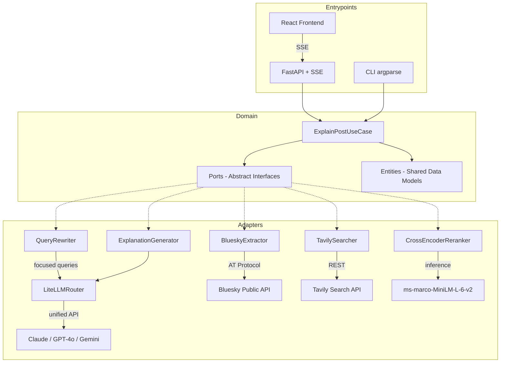
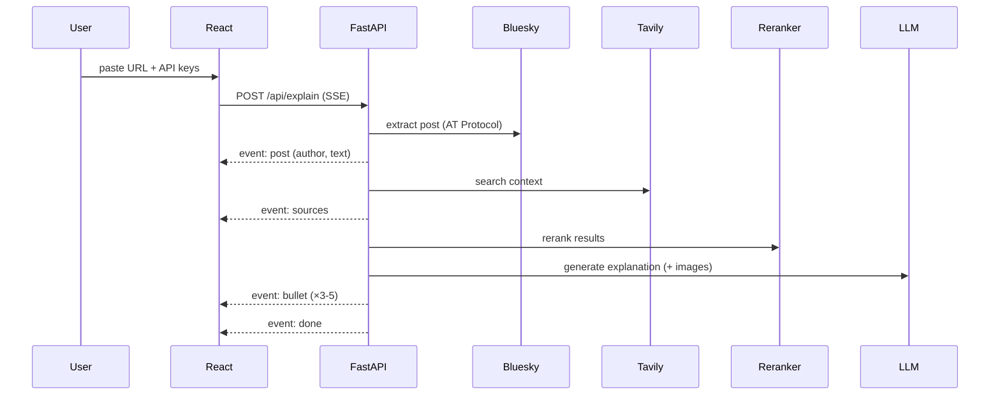

# Bluesky Post Explainer

AI agent that explains Bluesky social media posts by searching for relevant web context and synthesizing explanatory bullets with source citations.

## Quick Start

### Prerequisites

- Python 3.11+
- Node.js 18+
- API keys: Tavily (search), Anthropic or OpenAI (LLM)

### Setup

```bash
# Clone and setup backend
git clone https://github.com/raulprocha/bluesky-post-explainer.git
cd bluesky-post-explainer
python3 -m venv venv
source venv/bin/activate
pip install -e ".[dev]"

# Setup frontend
cd frontend
npm install
cd ..
```

### Running

```bash
# Terminal 1: Backend (FastAPI)
source venv/bin/activate
uvicorn src.entrypoints.api:app --host 0.0.0.0 --port 8000

# Terminal 2: Frontend (React/Vite)
cd frontend
npm run dev
```

Open http://localhost:5173 (or whichever port Vite assigns) — paste your API keys and a Bluesky post URL.

## Architecture

Hexagonal (Ports & Adapters) architecture with clear separation of concerns:



### Pipeline Flow



### Project Structure

```
src/
├── domain/              # Core logic — zero external dependencies
│   ├── entities.py      # Pure dataclasses (PostContent, SearchResult, etc.)
│   ├── exceptions.py    # Domain exception hierarchy
│   ├── ports.py         # Abstract interfaces (PostExtractorPort, SearchPort, etc.)
│   └── use_cases.py     # ExplainPostUseCase — orchestrates the pipeline
├── adapters/            # Concrete implementations of ports
│   ├── bluesky_extractor.py    # AT Protocol post extraction
│   ├── tavily_searcher.py      # Tavily web search
│   ├── query_rewriter.py       # LLM-based search query rewriting (cloud)
│   ├── local_query_rewriter.py # CPU-based query rewriting (Qwen2.5-0.5B)
│   ├── crossencoder_reranker.py # ML reranking (sentence-transformers)
│   ├── litellm_router.py       # Multi-LLM routing via LiteLLM
│   └── explanation_generator.py # Bullet generation with citations
└── entrypoints/         # Interface layer
    ├── api.py           # FastAPI + Server-Sent Events streaming
    └── cli.py           # CLI interface
frontend/                # React (Vite + TypeScript)
eval/                    # Evaluation harness
```

The FastAPI backend streams results to the React frontend via Server-Sent Events (SSE), providing progressive updates at each pipeline stage.

## Key Design Decisions

### 1. Hexagonal Architecture

The domain layer defines ports (abstract interfaces) that adapters implement. This means:
- The core use case doesn't know about Bluesky, Tavily, or any specific LLM
- Adapters can be swapped without changing business logic
- Testing is straightforward — mock any port

### 2. Server-Sent Events (SSE) Streaming

Instead of waiting for the full pipeline to complete, the backend streams progress events as each stage finishes. The frontend renders results progressively — post content, sources, then bullets one by one. This keeps the UI responsive during the 5-15 second pipeline execution.

### 3. Query Rewriting (Retrieval Quality)

Social media posts are conversational and full of slang, making them poor search queries. Before searching, the post is rewritten into 1-3 focused queries that extract key entities and topics. For example, "Jane Yolen has passed...450 books...the matriarch of children's books" becomes `["Jane Yolen children's author obituary", "Jane Yolen 450 books career"]`. Combined with Tavily's `general` topic (instead of `news`), this dramatically improves retrieval relevance for niche and non-news posts.

Two interchangeable rewriter adapters are provided (same `QueryRewriter` interface, swappable via the hexagonal architecture):

- **`QueryRewriter`** — uses the configured cloud LLM (Claude/GPT-4o). Higher quality, captures intent (e.g. infers "obituary" from "has passed"). Costs API tokens.
- **`LocalQueryRewriter`** — uses `Qwen2.5-0.5B-Instruct` running locally on CPU. Zero API tokens, slightly lower quality, adds local inference latency.

**Comparative metrics** (10 test posts, scored by the same LLM judge):

| Rewriter | Faithfulness | Answer Relevance | Context Helpfulness | API cost |
|----------|:---:|:---:|:---:|:---:|
| Cloud LLM (Claude) | **0.84** | **4.0** | **3.80** | tokens/request |
| Local CPU (Qwen2.5-0.5B) | 0.79 | 3.9 | 3.76 | none |
| No rewriting (raw text + `news`) | 0.77 | 3.5 | 3.18 | none |

The local model recovers most of the quality gain at zero token cost — a strong option when the token budget is tight. Full per-post breakdowns are in `eval/report.json` (cloud) and `eval/report_local.json` (local). Both rewriters fall back to the raw post text if generation fails.

### 4. Cross-Encoder Reranking (ML Module)

Search results from Tavily are reranked using `cross-encoder/ms-marco-MiniLM-L-6-v2`. Unlike bi-encoders that score query and document independently, cross-encoders process the (query, document) pair jointly through self-attention, producing significantly more accurate relevance judgments. Falls back to Tavily's native scoring when PyTorch is unavailable.

### 5. Multi-LLM Provider Routing

The LLM Router supports multiple providers (Claude, GPT-4o, Gemini) via LiteLLM's unified interface. It auto-detects which provider to use based on which API key the user provides. If a provider fails, it falls back to the next available one.

### 6. Image Understanding

Posts with embedded images are handled by fetching the image from Bluesky's CDN, detecting the actual MIME type from HTTP response headers, encoding as base64, and passing to a vision-capable model. The LLM sees both the text context and the visual content.

### 7. Per-Request API Keys

API keys are provided by the user in the frontend and sent per-request. They are never stored on the server. This avoids requiring server-side key management while allowing anyone to run the app with their own keys.

## Evaluation Harness

Located in `eval/`, the evaluation framework scores agent outputs using LLM-as-judge methodology based on the RAG Triad:

- **Faithfulness** (0.0–1.0): Are claims grounded in retrieved context?
- **Answer Relevance** (1–5): Does the explanation address the post's core content?
- **Context Helpfulness** (1–5): Credibility, clarity, relevance, veracity, neutrality

### Test Cases

`eval/test_cases.json` contains 10 real Bluesky posts with expected outputs generated by the agent. `eval/sample_outputs.json` contains the full agent outputs (bullets, citations, model info) for each test case. `eval/report.json` (cloud rewriter) and `eval/report_local.json` (local CPU rewriter) contain LLM-as-judge scores for each post across the three RAG Triad dimensions.

Posts cover diverse topics: Ukraine/geopolitics, US politics, tech/dev, social commentary, tributes, and posts with images.

### Running Evaluation

```bash
source venv/bin/activate
python -m eval.cli --provider anthropic/claude-sonnet-4-20250514 --output eval/report.json
```

This re-runs the full pipeline on each test post and scores the output with an LLM judge using the actual retrieved context.

## Bonus Features

| Feature | Implementation |
|---------|---------------|
| Image understanding | `ExplanationGeneratorAdapter.process_images()` — base64 encoding with MIME detection |
| Multi-LLM comparison | `LiteLLMRouter` — auto-detect from key, fallback chain, explicit routing |
| Source citations | System prompt instructs inline citations; `_extract_citations()` parses URLs from bullets |

## Assumptions

- Bluesky was chosen as the social platform because its AT Protocol provides unauthenticated public API access, eliminating OAuth complexity
- The cross-encoder reranker (`ms-marco-MiniLM-L-6-v2`) runs locally and requires PyTorch (~2GB install). For lightweight deployments, set `ENABLE_CROSSENCODER=1` to activate it. Without it, the system uses Tavily's built-in relevance scores to rank results — still functional, just less precise
- The evaluation harness uses LLM-as-judge rather than hard-coded expected outputs, since explanation quality is subjective and context-dependent
- API keys are provided per-request to avoid server-side secret management for a demo application

## Tech Stack

| Layer | Technology |
|-------|-----------|
| Frontend | React 18, TypeScript, Vite |
| Backend | FastAPI, Uvicorn, SSE |
| LLM | LiteLLM (Claude, GPT-4o, Gemini) |
| Search | Tavily API |
| ML | sentence-transformers CrossEncoder |
| Protocol | AT Protocol (Bluesky public AppView) |
